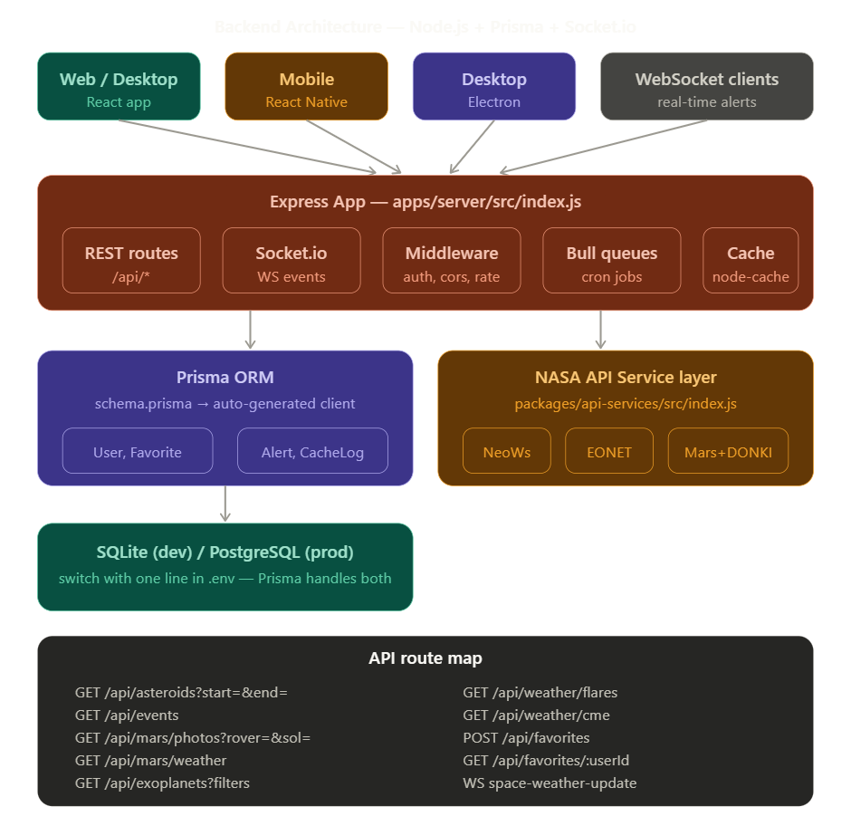

### Explore And Learn
A progressive web, desktop, mobile app that serves as NASA platform.

### Project Structure
This is the initial project structure and plan
## Monorepo Architechture
Project architecture guideline:
- **Backend Architecture**


## Project folder structure (TurboRepo)
Initial Full backend structure:
```
apps/server/
├── prisma/
│   └── schema.prisma
├── src/
│   ├── index.js           ← app entry point
│   ├── socket.js          ← Socket.io setup
│   ├── prisma.js          ← shared Prisma client
│   ├── routes/
│   │   ├── asteroids.js
│   │   ├── events.js
│   │   ├── mars.js
│   │   ├── weather.js
│   │   ├── exoplanets.js
│   │   └── favorites.js
│   ├── services/
│   │   ├── nasaApi.js     ← all NASA fetch calls
│   │   └── cache.js       ← caching layer
│   ├── jobs/
│   │   └── weatherPoller.js ← Bull cron job
│   └── middleware/
│       ├── auth.js
│       ├── errorHandler.js
│       └── rateLimiter.js
├── .env
└── package.json
```

### Project Features
- **Asteroid Tracker + 3D Orbit Visualizer**
The Near Earth Object Web Service (NeoWs) gives you access to near Earth asteroid information, including approach dates, miss distances, and sizes. You render the orbital paths in Three.js as a live 3D solar system. Advanced twist: add impact probability heatmaps and push notifications when a notable asteroid passes.
- **Natural Disaster Monitor**
EONET is a prototype web service providing continuously updated natural event metadata such as storm imagery gathered from the Earth's surface. Combine it with GIBS, which provides access to global full-resolution satellite imagery in a highly responsive manner enabling interactive exploration of Earth — overlay disaster events on live satellite map tiles updated within hours of observation.
- **Mars Mission Control Dashboard**
It pulls Mars Rover photos filtered by camera type and Martian sol day, combined with InSight lander weather data (wind, pressure, temperature). Store favorite images in MongoDB, build a timeline scrubber to travel through the mission.
- **Space Weather Alert System**
The DONKI API provides space weather notifications including solar flares and coronal mass ejections (CMEs). Build a Node.js backend that polls it every hour and pushes WebSocket alerts to a React dashboard with predicted Earth impact windows. It's FOSS
- **Exoplanet Explorer**
NASA's Exoplanet Archive has data on over 5,500 confirmed planets outside our solar system. Build filters for planet radius, orbital period, equilibrium temperature, and calculate a custom habitability score. Visualize with D3.js scatter plots comparing them to Earth.

### Future Enhancement
- **AI Space Assistant**
The most advanced project — combine multiple NASA APIs as a real-time data source fed into an LLM (like Claude via API). A user asks "any dangerous asteroids this week?" and the backend fetches live NeoWs data, formats it, and passes it to the AI to answer in natural language. Essentially a NASA-powered AI chatbot with live data.

### Dependencies
- **Root**
npm init -y (create package.json)
npm install turbo --save-dev (install TurboRepo)
- **Core Server**
npm install express cors helmet morgan dotenv
- **WebSockets**
npm install socket.io
- **Prisma**
npm install prisma @prisma/client
npx prisma init --datasource-provider sqlite
- **#Job queues (for DONKI hourly polling)**
npm install bull ioredis
- **HTTP client + caching**
npm install node-fetch node-cache
- **Auth**
npm install jsonwebtoken bcryptjs
- **#Validation**
npm install joi
- **#Dev tools**
npm install --save-dev nodemon eslint

- **Web (React + Vite)**
npm create vite@latest . -- --template react
npm install axios socket.io-client three d3 leaflet zustand
npm install react-router-dom @react-three/fiber @react-three/drei

- **Desktop (Electron)**
npm init -y
npm install electron electron-builder
npm install --save-dev concurrently wait-on

- **Mobile (Expo)**
npx create-expo-app . --template blank
npx expo install expo-notifications expo-location
npm install @react-navigation/native @react-navigation/bottom-tabs
npx expo install react-native-screens react-native-safe-area-context
npm install socket.io-client axios zustand